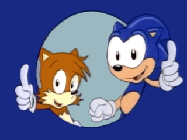
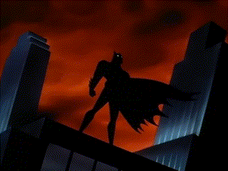

# SAROO_Tools
Tools for the Sega Saturn SAROO

This repository contains two tools to help you create custom **backgrounds** for your SAROO Optical Drive Emulator for SEGA Saturn. With these scripts, you can create your own **animated GIF visuals** and **looping background music** to personalize your SAROO experience.

## 📦 Tools Included

### 🎞️ [SAROO Animated Background Image Creator](README_SAROO_gif.md)
  Easily convert any collection of still images into a compatible animated GIF that displays correctly on SAROO without colour corruption or playback issues.
[Click here for the detailed readme](README_SAROO_gif.md)

### 🎵 [SAROO Background Music Processor](README_SAROO_music.md)
Convert audio or video files into raw 16-bit PCM suitable for SAROO background music, complete with optional looping.
[Click here for the detailed readme](README_SAROO_music.md)

---

## 💡 Why This Exists

Although SAROO has supported animated GIFs and background music since firmware v0.5, there's still very little community-made content out there a year later. The creation process was poorly documented and often frustrating, with tools like ezgif producing unreliable results.

These scripts were created to make it **easy and consistent** for anyone to generate SAROO-compatible files.

Let’s help build a library of awesome backgrounds and bring the Saturn’s startup screen to life.

## 🛠 Requirements

- [FFmpeg](https://ffmpeg.org/download.html) must be installed and accessible from your system path.

---

## Examples
Playback on the Saturn is slower than they appear on website.

Example of an animated GIF created, that includes a 10-second pause.

Example of a looping animated GIF, that includes no pause.

---

## Elsewhere on GitHub

If you create your own background GIFs and music, I recommend sending them to [WilliamDSW's repo](https://github.com/williamdsw/saroo-backgrounds) for inclusion in their collection.

The official Saroo Github repository is at [https://github.com/tpunix/SAROO](https://github.com/tpunix/SAROO)

---

This utility is provided **as-is**, free to use and distribute.  Please do not modify before distribution.  Attribution appreciated.

Please consider subscribing to my YouTube channel and supporting me on ko-fi.

- ☕ [ko-fi.com/widge](https://ko-fi.com/widge)
- 📺 [youtube.com/@Widge](https://www.youtube.com/@Widge)  
- 📰 [therealwidge.co.uk](https://www.therealwidge.co.uk/)

I also wrote a blog post for my website about the creation of this tool, check it out at [https://www.therealwidge.co.uk/2025/06/making-saroo-backgrounds-easily.html](https://www.therealwidge.co.uk/2025/06/making-saroo-backgrounds-easily.html)

And there's now a YouTube video about it too : [Click the image to watch it...](https://www.youtube.com/watch?v=wmOiLromUjo)

